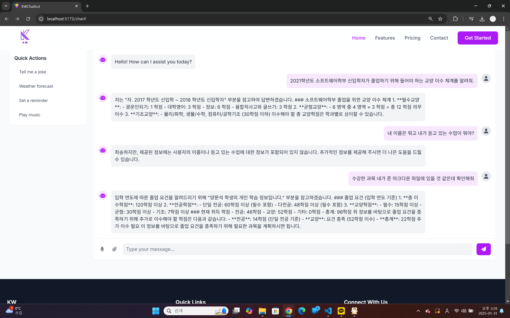
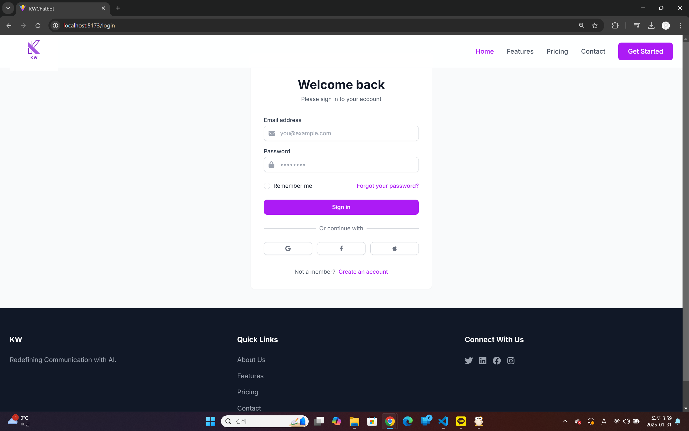

# Project Title

KWChatBot

## Description

ChatBot using RAGS




## Getting Started

### Dependencies

### Executing program

루트폴더에 .env파일을 만들고 다음과 같이 설정해주세요.
```
OPENAI_API_KEY = "your openai api key"
HF_HUB_DISABLE_SYMLINKS_WARNING = 1
MONGO_URI = "your mongouri"
SECRET_KEY = "your secret key"
```
SECRET_KEY는 다음의 명령어로 생성해주세요
```
openssl rand -hex 32
```
프로젝트 루트폴더에서 다음 명령어로 의존성를 설치해주세요.(파이썬 가상환경을 사용하시기를 권고합니다.)
```
pip install -r requirements.txt
```
의존성 설치 후 다음 명령어를 실행하면 백엔드 서버가 실행됩니다.
```
py main.py
```
프론트엔드는 frontend 폴더에 들어간 뒤
```
npm run dev
```
을 실행해주세요.
